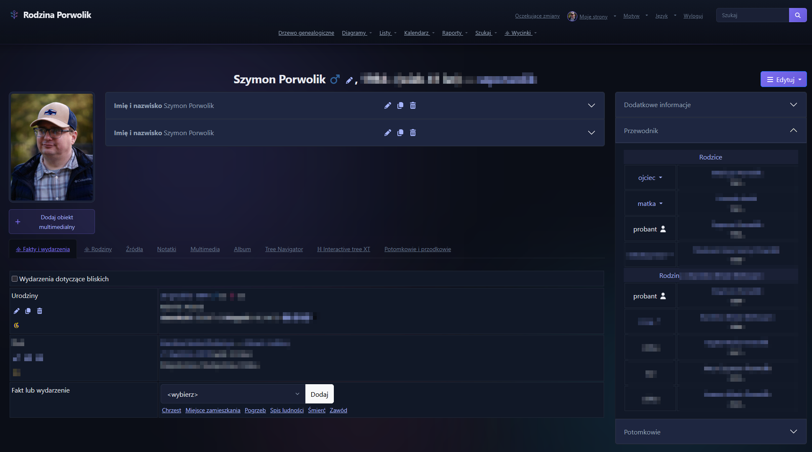

# Noctis Theme for webtrees

[](https://github.com/szporwolik/webtrees-theme-noctis/releases)
[](https://github.com/fisharebest/webtrees)
[](https://github.com/szporwolik/webtrees-theme-noctis/releases)
[](https://www.gnu.org/licenses/gpl-3.0)

A modern, handcrafted dark theme for [webtrees](https://webtrees.net/) — the leading open-source genealogy application.

The goal is to deliver a clean, modern dark UI that feels cohesive, accessible, and pleasant for long genealogy sessions. This theme is inspired by the work of the author of [JustLight](https://github.com/JustCarmen/webtrees-theme-justlight).

**Repo:** https://github.com/szporwolik/webtrees-theme-noctis


Built with care for aesthetics, accessibility, and performance. Follows 2026 design trends: glassmorphism headers, ambient aurora effects, refined typography, and a deep blue-black palette that's easy on the eyes during long research sessions.

## Author

**Szymon Porwolik** — [szymon.porwolik.com](https://szymon.porwolik.com)

## Features

- **Deep palette** — Navy-black backgrounds (`#0b0e17`) with violet (`#7c6ef0`) accents
- **Glassmorphism header** — Frosted blur effect with gradient accent line
- **Ambient aurora** — Subtle animated background blobs (3 layers, hardware-accelerated)
- **Auto-hide header** — Slides away on scroll-down for mobile (returns on scroll-up)
- **User avatar** — Pulls your GEDCOM photo into the navigation bar
- **Full chart support** — Pedigree, fan, lifespans, timeline, statistics — all dark-native
- **Leaflet maps** — Dark tiles, proper `invalidateSize()` fix after CSS load
- **TomSelect** — Styled dropdowns that integrate seamlessly
- **Google Charts** — SVG text and gridline overrides for dark backgrounds
- **Responsive** — Mobile-first, Bootstrap 5.3.3 dark mode variables
- **Accessible** — WCAG focus outlines, skip-to-content link, keyboard navigation
- **Print-friendly** — Clean white output when printing
- **Custom scrollbars** — Themed for WebKit and Firefox

## Screenshots



## Installation

1. Download or clone this repository
2. Copy the folder into your webtrees `modules_v4/` directory
3. Rename it as you prefer (e.g. `noctis-theme`)
4. Go to **Control Panel → Module administration** → enable **Noctis**
5. Set as default or let users select it from the theme picker

## Color Palette

| Token            | Value                                       |
|------------------|---------------------------------------------|
| Background       | `#0b0e17` — deep navy black                 |
| Surface          | `#1e2640` — elevated panels                 |
| Accent           | `#7c6ef0` — vibrant violet                  |
| Accent secondary | `#38bdf8` — sky blue (male charts)          |
| Accent warm      | `#f472b6` — soft pink (female charts)       |
| Text primary     | `#e8eaf0` — near-white                      |
| Text secondary   | `#94a3b8` — muted slate                     |
| Links            | `#a5b4fc` — light indigo                    |

## Requirements

- webtrees **2.1+**
- PHP **8.1+**

## Standards

- PHP: [PSR-12](https://www.php-fig.org/psr/psr-12/) Extended Coding Style
- JavaScript: [semistandard](https://github.com/standard/semistandard)
- CSS: BEM-inspired naming with `mn-` prefix for custom properties

## Project Structure

```
├── module.php              # Entry point (returns theme instance)
├── NoctisTheme.php         # Theme class (extends MinimalTheme)
├── LICENSE                 # GPL-3.0
├── README.md
├── screenshots/            # README images
└── resources/
    ├── css/
    │   └── noctis.css      # Complete dark stylesheet (~2400 lines)
    └── views/
        ├── individual-page-images.phtml
        ├── layouts/
        │   ├── default.phtml
        │   ├── head/       # meta, title, favicons, stylesheets
        │   └── body/       # navigation, search, scripts, accessibility
        └── theme/
            ├── footer.phtml
            └── footer-credits.phtml
```

## Contributing

This is a personal project. Issues are welcome, but pull requests are not accepted.

## License

[GPL-3.0-or-later](https://www.gnu.org/licenses/gpl-3.0.html) — same license family as webtrees itself.
